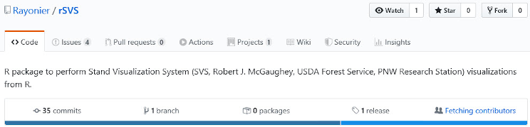
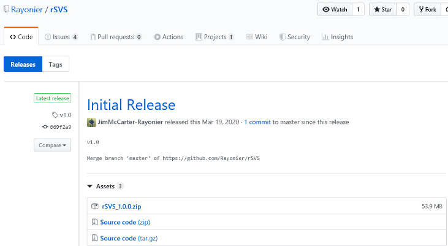
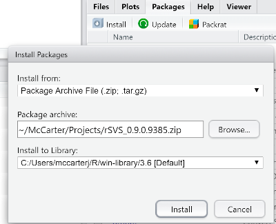
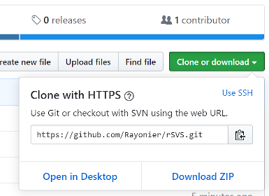

# rSVS

This rSVS package provides an interface to perform Stand Visualization System (SVS, Robert J. McGaughey, USDA Forest Service, PNW Research Station) visualizations from R.

Please contact Jim McCarter (jim.mccarter@rayonier.com) with questions and comments about the rSVS package.

You can either download the binary package installation file from the dist folder or download the entire repository and build and install local.

## Installing binary distribution

Check the Release link the rSVS repository Code tab for the most recent version.



From the Release Page you can download the appropriate .zip file used for installation.



The easiest way to install the binary distribution is to use the Install button on the Packages tab in RStudio.  On the Install Packages dialog change Install from: to "Package Archive File (.zip; .tar.gz)" and browse to where you saved the download .zip file, confirm Install to library, and click the Install button.



Use "Install package(s) from local files" on the Packages menu if you are using RGui.

## Installing from downloaded repository



NOTE: You will need devtools and dependencies to build the package from the repository.

Open RStudio and navigate to the repository directory using Session/Set Working Directory.
```R
require(devtools)
devtools::build(binary=TRUE)
```

## Getting Started with rSVS

Once installed you can get an overview of the package by looking at the package documentation.
```R
help("rSVS-package")
```
Also see the [Wiki](https://github.com/Rayonier/rSVS/wiki) for examples and details.

NOTE: The first time you run many of the functions in rSVS the package will check to see if you have a Python distribution available.  If not, the package will prompt you to allow it to install (unzip) a package internal copy of Python so that it's "back-end" can do it's work.  Example visualizations from the SVS_Example() function will work without this step so that you can demo the package.

